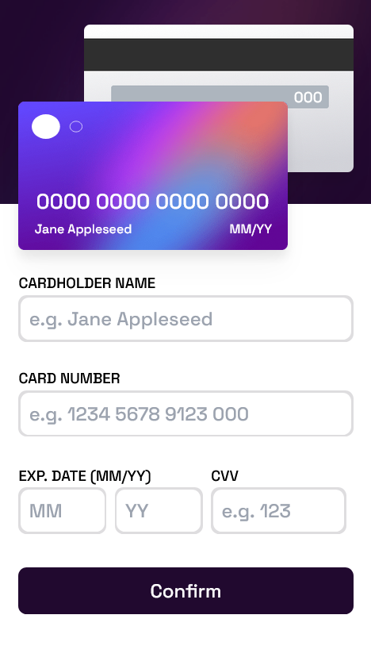

# Frontend Mentor - Interactive card details form solution

This is a solution to the [Interactive card details form challenge on Frontend Mentor](https://www.frontendmentor.io/challenges/interactive-card-details-form-XpS8cKZDWw). Frontend Mentor challenges help you improve your coding skills by building realistic projects.

## Table of contents

-   [Overview](#overview)
    -   [The challenge](#the-challenge)
    -   [Screenshot](#screenshot)
    -   [Links](#links)
-   [My process](#my-process)
    -   [Built with](#built-with)
    -   [What I learned](#what-i-learned)
    -   [Useful resources](#useful-resources)
-   [Author](#author)

## Overview

### The challenge

Users should be able to:

-   Fill in the form and see the card details update in real-time
-   Receive error messages when the form is submitted if:
    -   Any input field is empty
    -   The card number, expiry date, or CVC fields are in the wrong format
-   View the optimal layout depending on their device's screen size
-   See hover, active, and focus states for interactive elements on the page

### Screenshot

### Links

-   Solution URL: [https://github.com/mbramani/frontend-mentor-challenges/tree/main/interactive-card-details-form](https://github.com/mbramani/frontend-mentor-challenges/tree/main/interactive-card-details-form)
-   Live Site URL: [https://mbramani.github.io/frontend-mentor-challenges/interactive-card-details-form/](https://mbramani.github.io/frontend-mentor-challenges/interactive-card-details-form/)

## My process

### Built with

-   Semantic HTML5 markup
-   CSS custom properties
-   JavaScript
-   [React](https://reactjs.org)
-   [TailwindCss](https://tailwindcss.com/)
-   [Styled Components](https://styled-components.com/)
-   [Twin.macro](https://github.com/ben-rogerson/twin.macro)
-   Mobile-first workflow

### What I learned

-   about styled components

### Useful resources

-   [TailwindCss](https://tailwindcss.com/) - This helped me for how tailwind class work and how it can be use in html

## Author

-   Frontend Mentor - [@mbramani](https://www.frontendmentor.io/profile/mbramani)
-   Github - [@mbramani](https://github.com/mbramani)
