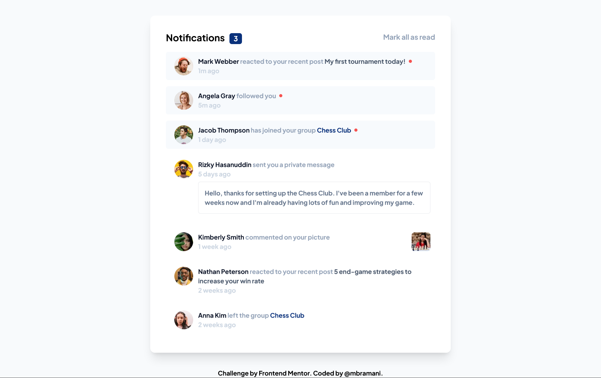
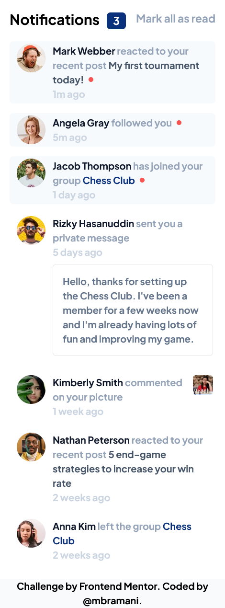

# Frontend Mentor - Notifications page solution

This is a solution to the [Notifications page challenge on Frontend Mentor](https://www.frontendmentor.io/challenges/notifications-page-DqK5QAmKbC). Frontend Mentor challenges help you improve your coding skills by building realistic projects. 

## Table of contents

- [Overview](#overview)
  - [The challenge](#the-challenge)
  - [Screenshot](#screenshot)
  - [Links](#links)
- [My process](#my-process)
  - [Built with](#built-with)
  - [What I learned](#what-i-learned)
  - [Useful resources](#useful-resources)
- [Author](#author)

## Overview

### The challenge

Users should be able to:

- Distinguish between "unread" and "read" notifications
- Select "Mark all as read" to toggle the visual state of the unread notifications and set the number of unread messages to zero
- View the optimal layout for the interface depending on their device's screen size
- See hover and focus states for all interactive elements on the page

### Screenshot

### Links

- Solution URL: [https://github.com/mbramani/frontend-mentor-challenges/tree/main/notifications-page-DqK5QAmKbC](https://your-solution-url.com)
- Live Site URL: [https://mbramani.github.io/frontend-mentor-challenges/notifications-page-DqK5QAmKbC/](https://mbramani.github.io/frontend-mentor-challenges/notifications-page-DqK5QAmKbC/)

### Built with

- Semantic HTML5 markup
- CSS custom properties
- Flexbox
- CSS Grid
- Mobile-first workflow
- JavaScript
- [Tailwindcss](https://tailwindcss.com/)

### What I learned

In this challenges i learned about 
- how to use grid
- how to set custom font in tailwind
- how to use custom property in tailwind
- how to select HTML Element using javaScript
- how to remove element from DOM
- how to add Event lister

### Continued development

I want to continue in how much responsive site can be and also in css grid

### Useful resources

- [TailwindCss](https://tailwindcss.com/) - This helped me for how tailwind class work and how it can be use in html

## Author

- Frontend Mentor - [@mbramani](https://www.frontendmentor.io/profile/mbramani)
- Github - [@mbramani](https://github.com/mbramani)

